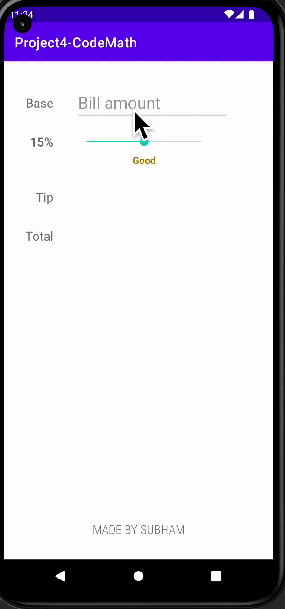

# AND101 Project 4 - CodeMath

Submitted by: **Subham Bhattacharya**

Time spent: **2** hours spent in total

## Summary

**Tip Calculator** is an android app that **will help the user caluclate the tip based on their bill**

If I had to describe this project in three (3) emojis, they would be: **:joy: :baby_chick: :moneybag:**

## Application Features

<!-- (This is a comment) Please be sure to change the [ ] to [x] for any features you completed.  If a feature is not checked [x], you might miss the points for that item! -->

The following REQUIRED features are completed:

- [x] At least one (1) user input
- [x] At least one (1) interactive View
- [x] At least one (1) output of a calculation based on the user input

The following STRETCH features are implemented:

- [x] Implement ViewBinding to reduce boilerplate code and increase efficiency
- [x] Changes color and word based on tip amount

The following EXTRA features are implemented:

- [x] List anything else that you added to improve the app!

## Video Demo

Here's a video / GIF that demos all of the app's implemented features:

GIF created with **Kap**

<!-- Recommended tools:
- [Kap](https://getkap.co/) for macOS
- [ScreenToGif](https://www.screentogif.com/) for Windows
- [peek](https://github.com/phw/peek) for Linux. -->

## Notes

This is a tip calculator app; I had actually made an app very similar to this a few years ago watching tutorials of a YouTuber named Rahul Pandey., who is also a great android developer, I decided to recreate this app but this time without watching any videos or taking any references online, overall I had a lot of fun making this app.

## License

Copyright **2023** **Subham Bhattacharya**

Licensed under the Apache License, Version 2.0 (the "License");
you may not use this file except in compliance with the License.
You may obtain a copy of the License at

    http://www.apache.org/licenses/LICENSE-2.0

Unless required by applicable law or agreed to in writing, software
distributed under the License is distributed on an "AS IS" BASIS,
WITHOUT WARRANTIES OR CONDITIONS OF ANY KIND, either express or implied.
See the License for the specific language governing permissions and
limitations under the License.
